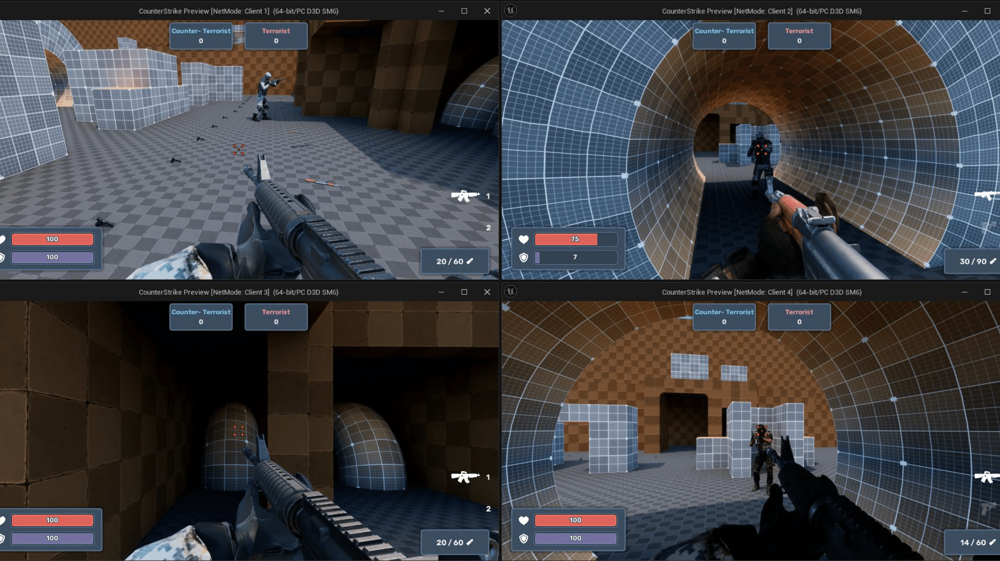
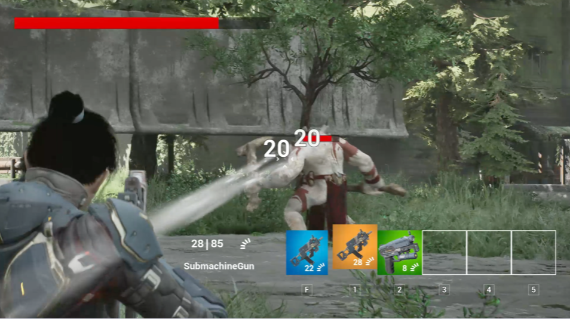
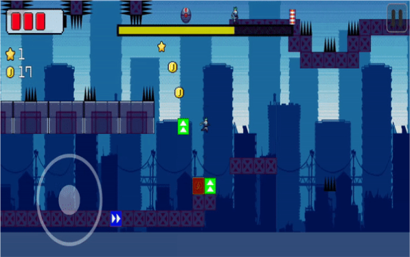
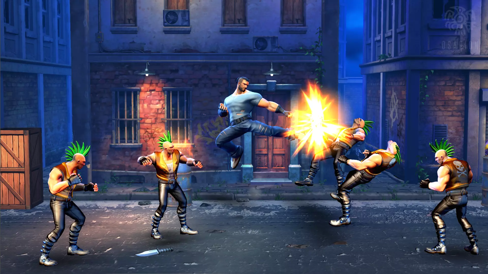

# Game Client Programer

## 끊임없이 성장하며 최고의 게임을 만들기 위해 도전하는 Game Client Programer입니다.

- **게임 클라이언트 프로그래머로서 다양한 플랫폼에서 폭넓은 개발 경험을 쌓아왔습니다.**
- **문제 해결 능력과 팀 협업을 바탕으로 프로젝트를 성공적으로 이끌어왔습니다**
- **트랜드에 뒤쳐지지 않기 위해서 새로운 기술들을 학습하며, 개발 역량을 꾸준히 확장하고 있습니다.**
- **앞으로도 최고의 게임을 만들기 위한 도전을 이어가며 더욱 발전하는 개발자가 되겠습니다.**

---

## 포트폴리오 요약

---

### 1. Unreal Engine Counter-Strike Style Multiplayer FPS Game

#### 프로젝트 개요

Counter-Strike 스타일의 멀티플레이어 FPS 게임으로, 팀 기반 전투 메커니즘과 네트워크 동기화 시스템을 구현했습니다. 캐릭터 이동, 무기 시스템, 전투 메커니즘 및 팀 기반 점수 시스템을 포함하여 멀티플레이어 환경에서 실시간 상호작용을 최적화했습니다.

#### GitHub Link

[https://github.com/SeoBYP/Unreal_Multiplay_FPS](https://github.com/SeoBYP/Unreal_Multiplay_FPS)

#### 프로젝트 요약

- **프로젝트 기간**: 2024년 2월 - 2024년 4월
- **플랫폼**: PC
- **엔진**: Unreal Engine
- **도구**: Git, C++

[Multiplayer FPS 플레이 영상](https://tv.kakao.com/v/446173331)

#### 주요 구현 상세

- **캐릭터 이동 및 애니메이션 동기화**: CharacterMovementComponent와 Animation Blueprint를 사용하여 클라이언트와 서버 간의 일관된 캐릭터 이동 및 애니메이션 동기화 구현.
- **무기 시스템 및 전투 메커니즘**: 무기 장착, 교체, 드롭, 탄약 관리 등을 Server RPC와 Multicast RPC로 구현해 모든 클라이언트에 전투 상태 동기화.
- **팀 점수 및 게임 상태 관리**: 팀 기반 점수 시스템과 승패 결정 시 게임 상태 갱신을 Multicast RPC로 처리하여 모든 클라이언트에서 동시 공유.
- **네트워크 통신 및 동기화**: 주요 상호작용을 서버 부하를 줄이기 위해 Server RPC와 Multicast RPC로 분리해, 클라이언트 응답성을 높이고 일관된 게임 상태 유지.

---

### 2. Unreal Engine TPS Game

#### 프로젝트 개요

언리얼 엔진을 사용하여 TPS(Third-Person Shooter) 게임을 개발했으며, 다양한 무기를 활용해 몬스터와 전투하는 게임입니다. TPS 장르의 특성을 반영하여 캐릭터 애니메이션, 무기 시스템, 몬스터 AI, 인벤토리 및 아이템 시스템을 구현했습니다.

#### GitHub Link

[https://github.com/SeoBYP/Unreal_Engine_5_TPS_Game](https://github.com/SeoBYP/Unreal_Engine_5_TPS_Game)

#### 프로젝트 요약

- **기간**: 2023년 6월 - 2023년 8월
- **플랫폼**: PC
- **엔진**: Unreal Engine
- **도구**: Git, C++

[TPS 게임 플레이 영상](https://tv.kakao.com/v/443649243)

#### 주요 구현 상세

- **캐릭터와 애니메이션**: Animation Montage와 Blendspace를 활용해 캐릭터의 자연스러운 움직임과 조준 고정 애니메이션 구현.
- **무기 시스템**: 권총, SMG, 기관총 등 다양한 무기와 사격 메카닉, 무기 전환 애니메이션, 발사 및 재장전 애니메이션 구현.
- **몬스터 AI**: Behavior Tree와 Task, Decorator 노드를 사용해 몬스터 행동 패턴과 상황별 반응 설정.
- **인벤토리 및 아이템 시스템**: 데이터 테이블을 통해 아이템 정보를 관리하고, 등급별 UI와 FX 효과로 시각적 매력 강화.

---

### 3. Nuclear-Zero: SF 아포칼립스 2D 플랫포머 러닝 게임

#### 프로젝트 개요

Nuclear-Zero는 SF 아포칼립스 세계관의 2D 도트 그래픽 플랫포머 러닝 게임입니다. 다양한 지형과 장애물을 통해 스테이지를 공략하며 숨겨진 알파벳을 수집하고 스토리의 비밀을 풀어나갑니다.

#### GitHub Link

[https://github.com/SeoBYP/Nuclear-Zero-Team5](https://github.com/SeoBYP/Nuclear-Zero-Team5)

#### 프로젝트 요약

- **프로젝트 기간**: 2022년 7월 - 2022년 9월
- **플랫폼**: Google Play Store
- **엔진**: Unity
- **도구**: Git, C#, Google API, Trello

[게임 소개 영상](https://www.youtube.com/watch?v=OmvdJE0bo2k)

#### 주요 구현 상세

- **플랫폼 기반 플레이 시스템**: 스테이지마다 다양한 블록 효과(회복, 가속, 감속 등)를 통해 긴장감과 전략성 강화.
- **미니게임 및 멀티 엔딩 시스템**: 각 스테이지의 별 획득 수에 따라 엔딩이 달라지며, 숨겨진 알파벳 수집을 통한 스토리 해금.
- **수익 모델**: Unity IAP를 활용한 인앱 결제와 Google Admob을 통한 광고 수익 시스템 구축.

---

### 4. Unity3D-Beat-em-Up Game

#### 프로젝트 개요

격투 게임의 타격감과 최적화를 중점으로 개발했습니다. 콤보 공격, 캐릭터 이동 및 점프, 인벤토리, 캐릭터 선택, 상점, 스테이지 클리어 등 다양한 기능을 구현하여 깊이 있는 게임 경험을 제공합니다.

#### GitHub Link

[https://github.com/SeoBYP/Unity3D-Beat-enUp-Game](https://github.com/SeoBYP/Unity3D-Beat-enUp-Game)

#### 프로젝트 요약

- **프로젝트 기간**: 2021년 4월 - 2022년 6월
- **플랫폼**: PC
- **엔진**: Unity
- **도구**: Git, C#

[게임 플레이 영상](https://www.youtube.com/watch?v=-DZdnJOjs60)

## 

#### 주요 구현 상세

- **콤보 공격 시스템**: 특정 키 패턴 입력 시 강력한 특수 공격 발동, 기 모으기 공격, 타격 판정 시스템으로 현실감 있는 타격감 제공.
- **캐릭터 이동 및 점프**: 중력 기반 점프와 애니메이션 블렌드 트리를 통한 자연스러운 캐릭터 움직임.
- **인벤토리 시스템 및 상점**: 아이템 장착과 해제, 전투에 필요한 장비와 아이템을 상점에서 구매할 수 있도록 구현.
- **스테이지 클리어**: 각 스테이지마다 점진적으로 상승하는 난이도와 다양한 적과의 전투 구조.

---

### 5. Unity3D-RPG

#### 프로젝트 개요

Unity를 배우며 처음 제작한 RPG 게임 프로젝트로, 다양한 RPG 게임의 필수 기능들을 구현하고 최적화에 집중했습니다. WOW, 리니지, 로스트아크 등 RPG 요소를 반영해 몰입감 있는 경험을 제공하고자 했습니다.

#### GitHub Link

[https://github.com/SeoBYP/Unity3D-RPG](https://github.com/SeoBYP/Unity3D-RPG)

#### 프로젝트 요약

- **프로젝트 기간**: 2021년 9월 - 2022년 3월
- **플랫폼**: PC
- **엔진**: Unity
- **도구**: Git, C#

[게임 플레이 영상](https://www.youtube.com/watch?v=lf2wziqD6Kw&t=5s)

## 

#### 주요 구현 상세

- **인벤토리 시스템**: 체력 및 마나 회복 아이템과 장비 아이템, 퀵슬롯을 통한 빠른 아이템 사용 기능 구현.
- **전투 시스템**: 스킬 및 콤보 공격, 스킬 강화 시스템을 통해 다양한 전투 전략 제공.
- **상점 시스템**: 아이템 구매 기능과 자원 관리로 게임 진행의 전략성 강화.
- **퀘스트 및 던전 시스템**: NPC와의 상호작용을 통한 퀘스트 진행과 보스 몬스터와의 던전 전투 구현.

---

<!--
**SeoBYP/SeoBYP** is a ✨ _special_ ✨ repository because its `README.md` (this file) appears on your GitHub profile.

Here are some ideas to get you started:

- 🔭 I’m currently working on ...
- 🌱 I’m currently learning ...
- 👯 I’m looking to collaborate on ...
- 🤔 I’m looking for help with ...
- 💬 Ask me about ...
- 📫 How to reach me: ...
- 😄 Pronouns: ...
- ⚡ Fun fact: ...
-->
