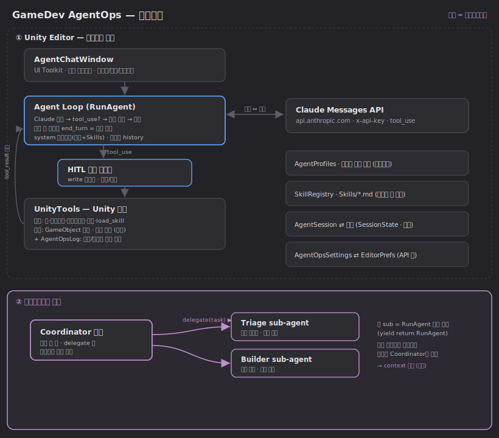
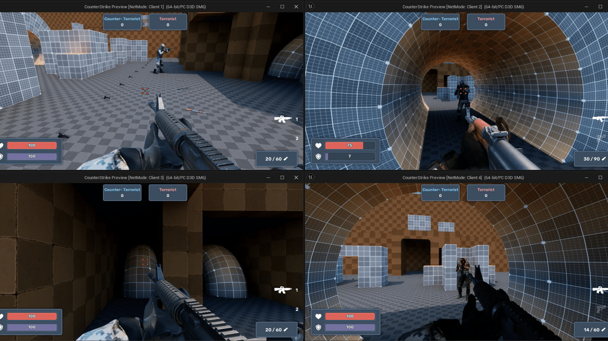
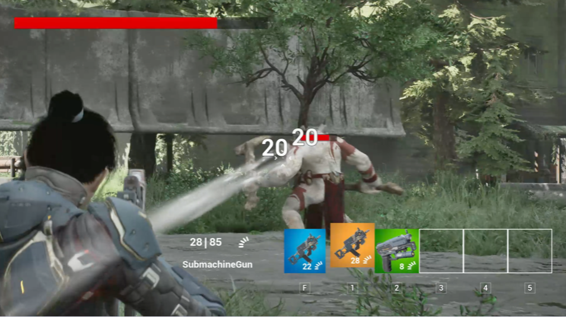
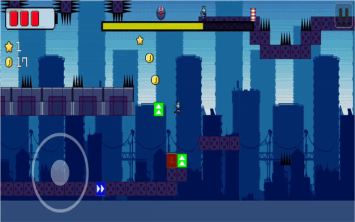
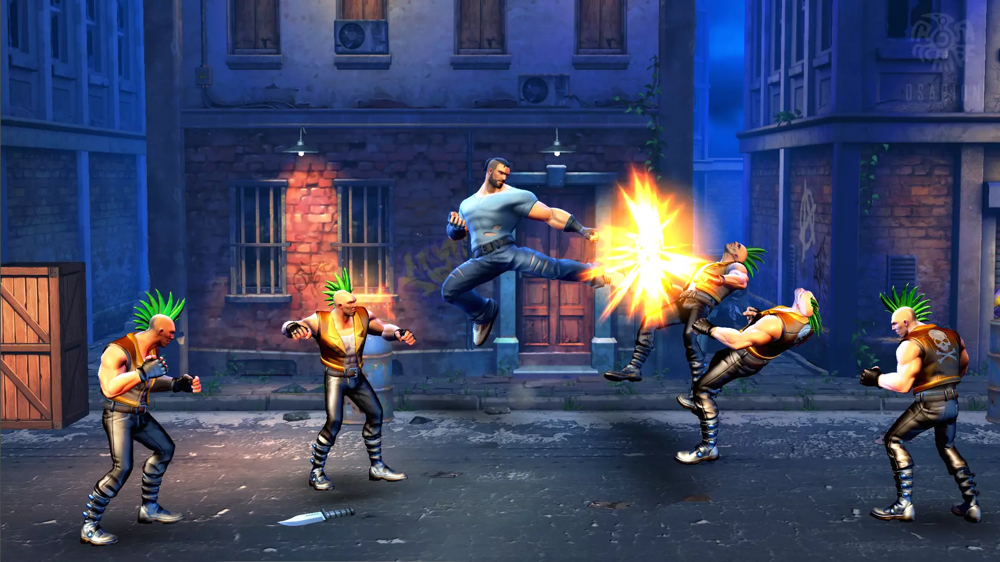

# 서병필 · Seo Byeongpil

### 🎮 Game Client Programmer · Unity

**Unity 게임 클라이언트 개발이 주력**입니다. 
게임 서버·백엔드로 **업무 역량을 확장**하고, **AI를 개발과 도구 제작에 적극 활용**합니다.

📫 byeongpilseo@gmail.com

---

## 👋 소개

- **Unity 게임 클라이언트가 주력인 게임 프로그래머**로, 단순히 "무엇을 만들었다"가 아니라 **어떤 문제를 어떤 구조로 풀었는지**를 중요하게 생각합니다.
- **🎯 주력 · 게임 클라이언트 (Unity / C#)** — 입력·이동·전투·카메라·UI 등 게임플레이 시스템을 **MVI · VContainer · 상태머신** 기반으로 설계합니다. Locomotion FSM과 Action축 분리, **GAS(Attribute·Effect·ASC)**, 입력 버퍼/상태머신 분리, Addressable 런타임 로드, 대화 GraphView 같은 **에디터 저작툴**까지 직접 구현했습니다.
- **🤖 강점 · AI 활용 / AI 에이전트 제작** — Claude API를 직접 호출해 Unity 에디터용 AI 에이전트를 **프레임워크 없이 바닥부터** 구현했고(아래 AgentOps), AI를 설계·구현·문서화 등 **개발 워크플로우에 적극 활용**합니다.
- **📈 확장 중 · 게임 서버 / 백엔드** — 게임의 데이터 흐름을 끝까지 이해하기 위해 **공부하며 실전 프로젝트로 역량을 넓혀가는 중**입니다. 서버 권위 멀티플레이, 이중 서버(gRPC + TCP), Redis Streams + Outbox 서버 간 연동, Clean Architecture, PostgreSQL + Redis를 직접 구현해봤습니다.
- 단위 / 통합(Testcontainers) / E2E 테스트로 회귀를 방지하는 개발을 지향하며, 현재 **OnewaveGames**에서 게임 클라이언트을 담당하고 있습니다.

---

## 🛠 기술 스택

**🎯 Game Client (Unity) — 주력**
`Unity 6` · `C#` · `VContainer (DI)` · `UniTask` · `R3` · `MVI / MVVM` · `상태머신(FSM)` · `GAS` · `Addressables` · `UI Toolkit`

**🤖 AI / Agent**
`Claude API (Messages · SSE)` · `tool_use 에이전트 루프` · `멀티에이전트` · `HITL` · `AI 활용 개발`

**📈 Game Server / Backend — 역량 확장 중**
`.NET 10` · `ASP.NET Core gRPC` · `TCP Socket` · `MemoryPack` · `EF Core` · `PostgreSQL` · `Redis (Streams · Cache)` · `Outbox 패턴` · `Clean Architecture`

**🛠 Infra / Tooling**
`Docker · Docker Compose` · `Serilog + Graylog` · `xUnit · Testcontainers` · `JWT` · `Git`

**📚 관심 · 학습 중**
`Java Spring` · `AWS` · `Kubernetes` · `Kafka`

---

## 🌟 대표 프로젝트

### 1. Multiplay-ActionRPG-Unity — 이중 서버 멀티플레이 액션 RPG

> **Unity 클라이언트를 주력으로 만들며, 게임 서버 영역까지 확장한 실전 프로젝트.** 대부분의 게임 로직은 gRPC(HTTP/2)로, 극한 실시간 인게임은 TCP + MemoryPack으로 처리하며, 두 서버는 **직접 RPC 없이 Redis Streams(Outbox 패턴)** 로만 통신합니다.

**🔗 [github.com/SeoBYP/Multiplay-ActionRPG-Unity](https://github.com/SeoBYP/Multiplay-ActionRPG-Unity)**

- **이중 서버 아키텍처** — `GameServer`(ASP.NET Core gRPC, 인증·로비·채팅)와 `SocketServer`(.NET Generic Host, TCP 입장·이동·전투)를 분리해 장애를 격리하고 던전에 독립 생명주기를 부여.
- **서버 간 강결합 제거** — GameServer ↔ SocketServer 직접 호출을 금지하고, DB 트랜잭션과 이벤트 발행을 **Outbox로 원자화**한 뒤 **Redis Streams Consumer Group**(at-least-once)으로 소비.
- **통신 3계층 분리** — gRPC Unary(요청-응답), gRPC Server Streaming(서버→클라 Push: 로비/채팅), TCP + MemoryPack(60Hz급 인게임 저지연).
- **Unity 클라이언트** — VContainer DI + **MVI**(OutGame/InGame)로 레이어 분리(`GUI → OutGame → System → Network` asmdef 강제). 게임플레이는 **Locomotion FSM + Action축 분리**, 입력 버퍼/상태머신 분리, **GAS 기반 서버 권위 전투**, 그리고 인벤토리·장비·상점·퀘스트·NPC 대화 UI와 **대화 GraphView 저작툴**까지 구현.
- **보안·세션** — JWT(Access/Refresh) + DeviceId 바인딩(SHA256), 토큰 로테이션·재사용 탐지, 단일 기기 세션.
- **테스트 3계층** — 단위 / 통합(**Testcontainers** 실 PostgreSQL+Redis) / E2E(Unity PlayMode가 **Docker 실서버**를 대상으로 검증).

`Unity 6` · `VContainer` · `MVI` · `GAS` · `.NET 10` · `ASP.NET Core gRPC` · `TCP + MemoryPack` · `Redis Streams` · `PostgreSQL` · `Clean Architecture` · `Docker`

---

### 2. GameDev-AgentOps — Unity 에디터 내 AI 에이전트 (프레임워크 없이 직접 구현)

> **Unity 에디터 안에서 도는 게임 개발용 AI 에이전트를 외부 프레임워크 없이 바닥부터 구현한 프로젝트.** Anthropic Claude Messages API를 직접 호출해 `tool_use` 루프 · 멀티에이전트 위임 · HITL(사람 승인)까지 손으로 짰습니다.

**🔗 [github.com/SeoBYP/GameDev-AgentOps](https://github.com/SeoBYP/GameDev-AgentOps)**

- **에이전트 루프 직접 구현** — 매 턴 `messages`를 키워 호출 → `stop_reason == tool_use`면 도구 실행 후 `tool_result`를 회신 → 반복. 응답은 `DownloadHandlerScript`를 상속해 **SSE를 직접 파싱**(스트리밍).
- **멀티에이전트 위임** — `delegate` 실행이 곧 또 하나의 에이전트 루프(중첩 코루틴). sub-agent는 독립 세션에서 처리하고 **결론만** 반환(context 격리).
- **이중 권한 게이트** — ① 모드별 허용 목록으로 도구 필터, ② 쓰기 도구는 코루틴을 멈추고 **사용자 승인(HITL)** + 경로 샌드박스.
- **회복력 엔지니어링** — 429/529/5xx **지수 백오프 재시도**, 빈 메시지 가드(400 방지), 세션은 도메인 리로드를 넘어 영속.
- **엔진 통합 깊이** — 도구 13개(읽기 8 / 쓰기 5)로 씬·콘솔·에셋을 읽고 GameObject·컴포넌트를 **실제로 생성·수정**. 타입은 **리플렉션**으로 동적 해석.

> 💡 **왜 강점인가** — LLM API·에이전트 루프·멀티에이전트·HITL을 **프레임워크 없이 직접** 다뤄 본 경험으로, AI를 **제품 기능과 개발 워크플로우 양쪽에** 녹여낼 수 있습니다.

채팅창 → Agent Loop ↔ Claude API → 도구 · HITL 승인 · 세션 영속 · 멀티에이전트(Coordinator → Triage/Builder 위임)

`Unity (URP)` · `UI Toolkit` · `C#` · `Claude API (SSE 스트리밍)` · `tool_use 루프` · `멀티에이전트` · `리플렉션`

---

## 📦 이전 프로젝트

<table>
  <tr>
    <td width="33%" valign="top">
       
      <b>Unreal Multiplayer FPS</b> 
      2024 · Unreal C++ 
      CS 스타일 팀 기반 FPS — Server/Multicast RPC 네트워크 동기화 
      <a href="https://github.com/SeoBYP/Unreal_Multiplay_FPS">GitHub</a> · <a href="https://tv.kakao.com/v/446173331">영상</a>
    </td>
    <td width="33%" valign="top">
       
      <b>Unreal Engine 5 TPS</b> 
      2023 · Unreal C++ 
      다양한 무기 시스템 · Behavior Tree 몬스터 AI · 인벤토리 
      <a href="https://github.com/SeoBYP/Unreal_Engine_5_TPS_Game">GitHub</a> · <a href="https://tv.kakao.com/v/443649243">영상</a>
    </td>
    <td width="33%" valign="top">
       
      <b>Nuclear-Zero</b> 
      2022 · Unity C# 
      2D 플랫포머 러닝 · <b>Google Play 출시</b> · IAP·광고 수익 모델 
      <a href="https://github.com/SeoBYP/Nuclear-Zero-Team5">GitHub</a> · <a href="https://www.youtube.com/watch?v=OmvdJE0bo2k">영상</a>
    </td>
  </tr>
  <tr>
    <td width="33%" valign="top">
       
      <b>Unity3D Beat-em-Up</b> 
      2021–2022 · Unity C# 
      콤보·타격감 중심 격투 게임 · 인벤토리·상점 
      <a href="https://github.com/SeoBYP/Unity3D-Beat-enUp-Game">GitHub</a> · <a href="https://www.youtube.com/watch?v=-DZdnJOjs60">영상</a>
    </td>
    <td width="33%" valign="top">
       
      <b>Unity3D RPG</b> 
      2021–2022 · Unity C# 
      첫 RPG 프로젝트 · 전투·인벤토리·퀘스트·던전 
      <a href="https://github.com/SeoBYP/Unity3D-RPG">GitHub</a> · <a href="https://www.youtube.com/watch?v=lf2wziqD6Kw">영상</a>
    </td>
    <td width="33%" valign="top"></td>
  </tr>
</table>

---

## 📊 GitHub

---

**끊임없이 성장하며, 문제를 구조로 푸는 개발자가 되겠습니다.**

📫 byeongpilseo@gmail.com

